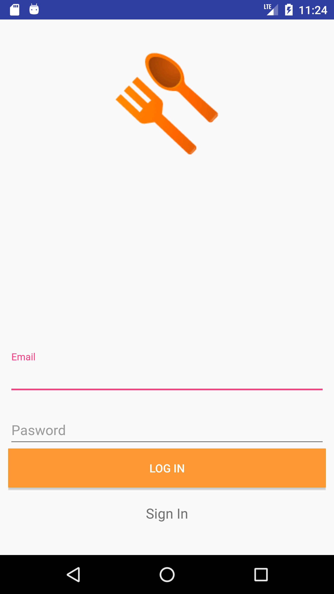
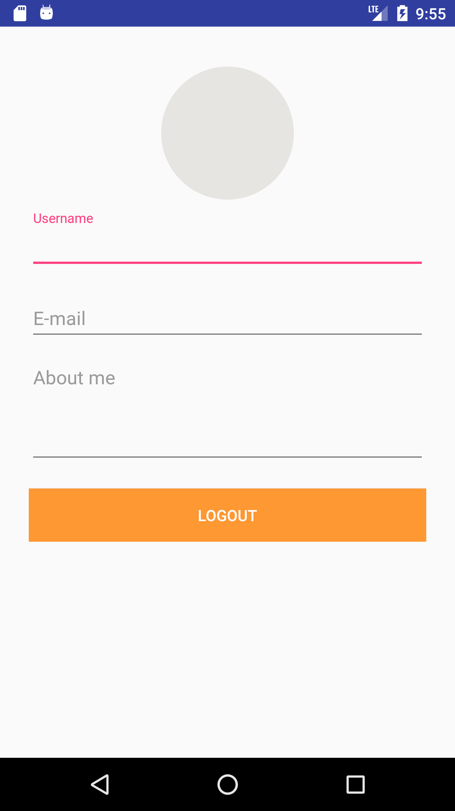

# droids4droids-modular-apps
Droid4Droids Lima - Building modular apps in Android 

## Demo : PeruvianRecipes APP

   

  

## Slide :

  [Building modular apps in Android](https://docs.google.com/presentation/d/1ZblfvJUdUSpgtPq88yC_gmZw2XMuU2WIZtdbOvWyZ6g/edit?usp=sharing)

## Issues

- Cualquier issue, duda o consulta lo puede dejar en este link [https://github.com/emedinaa/droids4droids-modular-apps/issues](https://github.com/emedinaa/droids4droids-modular-apps/issues) y lo atenderé a la brevedad.
